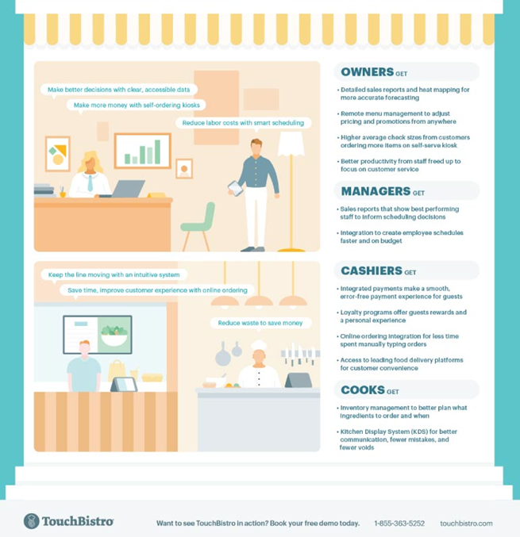
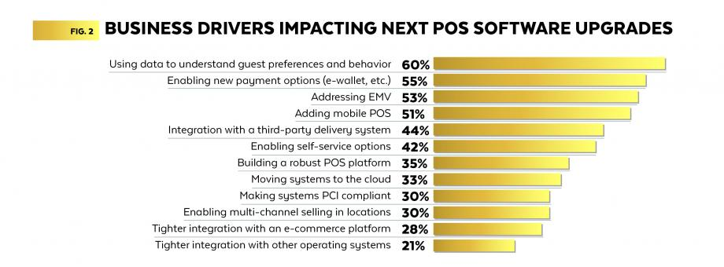

# TouchBistro Inc.

---

#### Overview

Toronto-based TouchBistro Inc. is rising as a fintech company that develops restaurant point-of-sale (POS) system for the iPad. TouchBistro, caters exclusively to the restaurant industry, and was founded by Alex Barrotti in 2010.

Barrotti came up with the concept for an iPad-based app for wait staff while dining at one of his friend's restaurant in the Caribbean. His friend was looking for ways to take care of his customers on the patio especially since they often faced issues in the Caribbean that we in Canada take for granted – e.g., intermittent power that went off at least thrice a day, and lack of steady, reliable Internet connection.

Barrotti’s friend was seeking a netbook solution, but that was too cumbersome, and they soon realized that a netbook was too bulky to carry around, and the iPhone was too small to provide a robust experience. So, by the time the iPad came out Barrotti thought of it as the perfect solution. And thus, TouchBistro was born. 

TouchBistro has been backed by the likes of OMERS, Barclays Bank, RBC, and BMO. The startup has strategic partnerships to provide its payment services with a number of its investors, which are some of the largest financial institutions around the world. In September 2019, TouchBistro closed a significant Series E funding round, raising CAD158 million from major investors including OMERS Growth Equity, Barclays Bank, RBC Ventures, and BMO Capital Partners. The round brought the startup’s total funding to date to almost CAD270 million as of April-2020.

#### Business Activities

TouchBistro is an app that supports tableside ordering, custom restaurant layouts, custom menus, bill splitting, sales reports, and an unlimited number of order and cash register printers. It is easily available from the iTunes store and has been the top grossing Food and Beverage iTunes app in over 34 countries. TouchBistro does not require an Internet connection, communicating with printers/cash drawers via a local Wi-Fi network. It also offers a Kitchen Facing Display and a Customer Facing Display. 

Each restaurant business in the industry is TouchBistro’s target customer. Apart from North America, they also have a large customer base in Europe. Currently they cater to around 28,000 restaurants in more than 100 countries worldwide. According to Acumens Research and Consulting the restaurant mobile POS market size was estimated to be around US$8 billion in 2018 and was expected to grow at a CAGR of around 13.2% between 2018 and 2025

TouchBistro provides an iOS based app (a SaaS model and an open API platform to connect with other best-in-breed applications for restauranteurs). It has a strong mix of restaurant-specific features that help manage inventory, orders, tables, reservations, catering and delivery, making it a good choice for nearly every type and size of establishment. Its software is competitively priced, and it is compatible with multiple payment processors and third-party POS hardware. TouchBistro is a hybrid solution and is not purely a web-based system. The locally installed network ensures that there is no disruption to the system if internet connection goes down, which is advantageous for businesses in areas with intermittent or unreliable internet connection. Within the app, one can also add cash drawers, receipt and kitchen printers, and barcode scanners to the TouchBistro POS system. The company does not sell unbundled POS hardware, but it posts a list of recommended models on its website.

The biggest advantage TouchBistro offers its users is reporting, analytics and customizable dashboards that can pretty much gather and sort any information required.

Since TouchBistro is a hybrid system that relies on an Apple-based infrastructure, a router needs to be installed (and in some cases a Mac, to be used as a server). TouchBistro is not a cloud-based POS system. The setup is more involved compared to some of TouchBistro's cloud-based competitors. The setup guides on the TouchBistro’s support page are very detailed and have step-by-step instructions with photos. The company's support team is available 24/7 to help remotely. For onsite installation assistance, TouchBistro partnered with Boomtown. As such, someone can set the system up on their behalf.  Once the system is set up, TouchBistro is easy to use and has an intuitive layout. 

#### Business Activities

TouchBistro is a major player in the Payments/billing domain of the Fintech industry and is one of Canada’s leading startups in the segment. Other major Canadian players in the sector include Buckzy, Dreampayments, Lightspeed, Mobeewave, Nanopay, Payvida, Remitr, Solink, Soundpays, Tacit, Tulip Retail, and Vouchr.

Since 2010, modern POS systems have become increasingly sophisticated, allowing business owners to manage front- as well as back-end operations. Integrated systems have enabled everything from inventory management to marketing, staff time-management, accounting processes, and customer information to be accessed, analyzed, and controlled through a touchscreen interface.

During the decade, use of cloud-based POS systems accelerated enabling companies to quickly and easily access their sales and customer data and make decisions accordingly making cloud-based POS systems particularly attractive for companies that ran a franchise model with multiple stores.

The growth of cloud-based POS naturally coincided with new trends around mobile POS. Like most Apple’s store-employees, many business owners and workers began to use POS systems on mobile devices from 2010, which became easier, thanks to tablets and smartphones with increasingly larger displays and better processing power.

Fintech innovators and developers began offering business applications for free, instead opting to take a cut of each sale through payment processing fees. Mobile POS systems empowered employees to easily look up product information, search for answers to customer queries and take payments while walking around the shop floor. Consumers, too, benefited from mobile POS systems by buying goods and services on devices on their own smartphones with a tap, using technologies such as NFC and Bluetooth.

The current decade is likely to continue seeing a convergence in technologies, with POS systems becoming smarter and able to help businesses get even more value out of their data than they can today.

#### Results

TouchBistro has not revealed its financials in the public domain, but its 2019 revenue was estimated to be around USD 50 million. As a metric, its monthly recurring revenue (MRR) grew 58% year-on-year (y-o-y). It had achieved a 100% y-o-y sales growth in 2018. The company now adds 500 to 700 customers and USD 1 million in annualized revenue monthly.

In late 2019, pension giant Ontario Municipal Employees Retirement System (OMERS) made its largest investment in a Canadian early-stage technology company, anchoring a $158-million venture financing in TouchBistro taking its valuation to around USD 500 million. This was one of the largest financings of a Canadian tech startup in 2019 and positioned TouchBistro to generate close to USD 50 million in 2019.

The company has struck payments processing revenue-sharing deals with J.P. Morgan in the United States, Barclays in Britain and Mexico’s EVO Payments, which may account for c. 21% of recurring revenue.

#### Recommendations

According to a survey conducted by Hospitality Tech the most important business driver for software upgrades was “data to understand guest preferences and behavior” followed by new payment options (e-wallets), EMV payments, mobile POS and integration with 3rd party delivery systems (see Chart 1), while the top 5 features or functionalities driving POS purchases included integration with other systems, Delivery integration, Loyalty tools, online POS for ordering and Mobile wallet (see Chart 2).

###### Chart 1: Drivers for POS Upgrades

###### Chart 2: Drivers for POS Purchases

 
Since the pandemic struck in early 2020, the restaurant industry globally came close to a standstill. As a result, TouchBistro’s business growth has also suffered a major roadblock. Of course, this situation was a misfortune and not likely to arise frequently but it has highlighted the vulnerability of the restaurant industry and through it, that of TouchBistro’s revenue stream. The needs that were created by the pandemic were more focused on customer independence, in terms of delivery, payments and the experience outside the brick-and-mortar restaurant. The effects of the pandemic will eventually be wiped-off, but these features are here to stay. 

I would recommend TouchBistro to accentuate customers’ out-of-restaurant ordering experience including those at kiosks. Features like integration with the restaurant’s website, online POS, EMV, delivery integration etc. would ensure return and growth of a restaurant’s customer base and in turn beneficial for TouchBistro. Analytics on these lines would help the restaurant understand data on customer locations, delivery times, order-size etc. and modify their operational efficiencies accordingly.
A wishful thinking would be for TouchBistro to develop AI-forecasting and recommendation tools that predict supply and demand based on the weather and other local information to help restaurants better plan ahead, and to create alerts if the system detects any irregularities, such as missing stock or funds and allow for more accurate benchmarking.

APIs will play a major role for TouchBistro to include the recommendations above. Also, Google is bringing about a disruption in a big way. Google has expanded from traditional AdWords to include restaurants and as such delivery platforms like Doordash, SkipTheDishes etc. may eventually fade away bringing the focus back to individual restaurants. Google will eventually become the source for much of restaurant’s inbound demand, and as a direct competitor, these platforms will be vulnerable.

Big Data will also play a major role to help accentuate customer experience through analytics.

Eventually, I believe the concept of a “Virtual Restaurant” would slowly gain popularity and will are become a staple in most large cities across the globe. As time goes on, the industry will likely see more virtual restaurants. Traditional restaurants seem to struggle with data collection and management; after all, it's virtually impossible to effectively track a person’s order, their opinion of the meal, and then interpret that in a meaningful way to improve their experience next time. Virtual restaurants now allow owners to collect and manage data more effectively - which they can use to make better strategic decisions.

---

##### References:
https://www.touchbistro.com/about-us/
https://en.wikipedia.org/wiki/TouchBistro_Inc.
https://www.businessnewsdaily.com/8068-best-pos-system-restaurants.html
https://www.theglobeandmail.com/report-on-business/small-business/a-tasty-ipad-solution-for-busy-restaurants/article4181214/
https://financialpost.com/technology/touchbistro-lands-4-5-million-funding-round-from-relay-ventures-to-take-a-bite-out-of-the-big-apple?r
https://www.techradar.com/news/the-evolution-of-pos-point-of-sale-systems
https://researchcentral.cibcwm.com/rcportal/cds?TYPE=PDF&ID=390CgjLbQUbX45nazYp4ZndttuxcIh22LIGUciYVxDE3o%3D
https://www.theglobeandmail.com/business/article-omers-makes-largest-canadian-tech-investment-to-date-with-100-million/
https://www.mobilepaymentstoday.com/blogs/how-mobile-payments-are-changing-the-restaurant-industry/
https://researchcentral.cibcwm.com/rcportal/brviewer?TYPE=BLOG&ID=6827H%2FafGI1%2Bl0BIuQElzIoU8Hoj69ALEX68oyjvtXXZM%3D
https://www.bnnbloomberg.ca/video/touchbistro-raises-163m-in-new-funding~1136125
https://research-doc.credit-suisse.com/docView?language=ENG&format=PDF&sourceid=csplusresearchcp&document_id=1082106811&serialid=9ItaQaLeKMYkTfzB0rHonfefWNL6W5uABHoXHk5EVRA%3D.
https://www.touchbistro.com/blog/the-future-of-the-restaurant-pos/
https://www.touchbistro.com/blog/the-real-impact-of-touchbistro-pos-on-a-full-service-restaurant/
https://www.cvca.ca/files/reports/2019-canadian-market-overview-report/CVCA_EN_Canada_VC_2019_Final-Mar13.pdf
https://hospitalitytech.com/2020-pos-software-trends-report-unlocking-agility
https://hoteltechreport.com/news/hotel-tech-trends-2021
https://www.thebalancesmb.com/virtual-restaurants-4173073