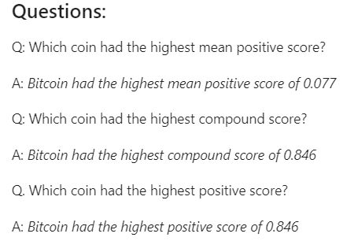
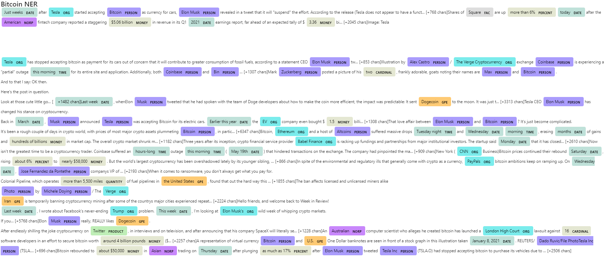
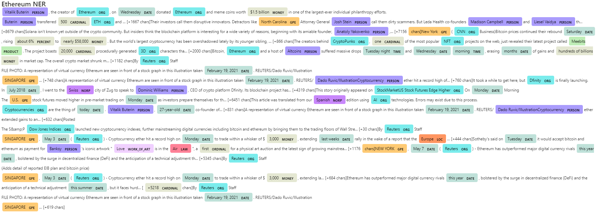

# Unit 12—Tales from the Crypto

## Submission

* The assignment is being submitted in the form of a Jupyter Notebook named "Main_crypto_sentiment.ipynb" to conduct the NLP analysis

## Summary of the Assignment

----

### 1 - Sentiment Analysis

The responses to the descriptive statistics are as follows:

---

### 2 - Natural Language Processing

An attempt has been made to use NLTK and Python to tokenize text, find n-gram counts, and create word clouds for both coins. 

#### Word Clouds

The generated word clouds for each coin are as follows:

---

### 3 - Named Entity Recognition

In this section, an NER model for both coins has been built and a visualization created for the tags using SpaCy. The snapshot of the rendering has been provided below:

---
---
