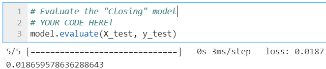
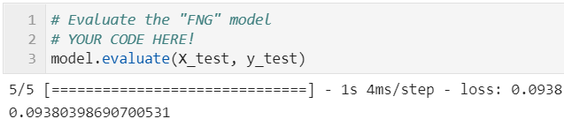
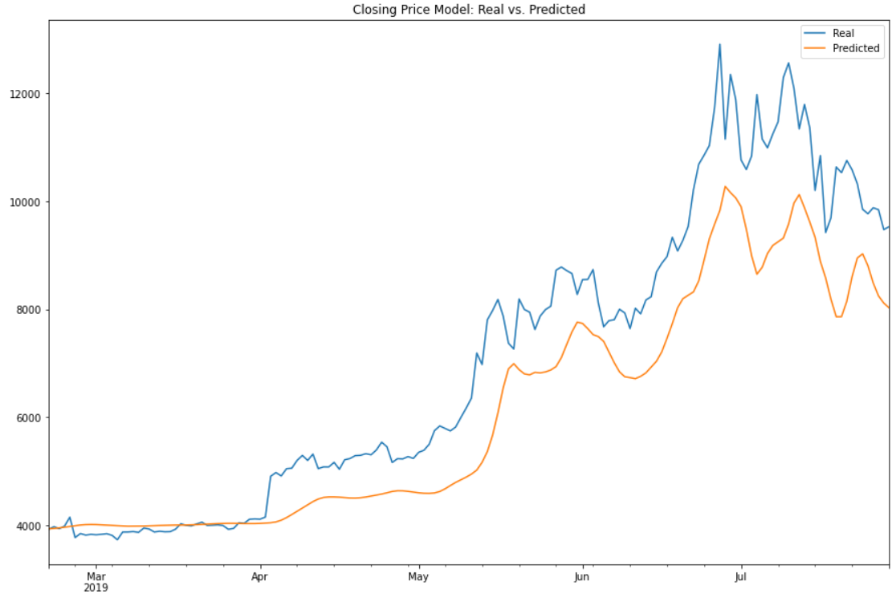
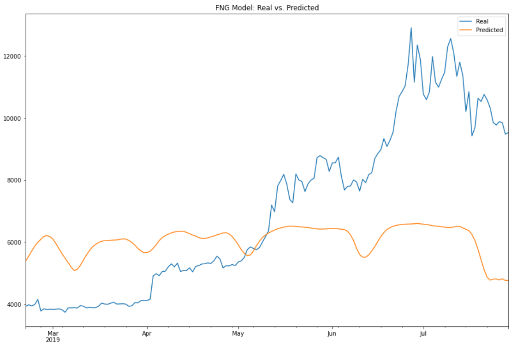

# Assignment: Unit 13 - LSTM Stock Predictor

### Submission

* The submission folder contains two notebooks (.ipynb) files named "Main_lstm_stock_predictor_closing" and "Main_lstm_stock_predictor_fng". The folder also contains  the two input files (btc_historic.csv and btc_sentiment.csv).

* The conclusions and observations of the comparison between the two models in each notebook are summarised below.

### Evaluation of the performance of each model

* Which model has a lower loss?

> *Between the two models, the Closing Prices Model had a lower loss of 1.87%.* 

---
* Which model tracks the actual values better over time?

> *Between the two models, the Closing Prices Model tracked the actual values better.* 

---
* Which window size works best for the model?
> *The model works best when window size = 1.* 

- - -

