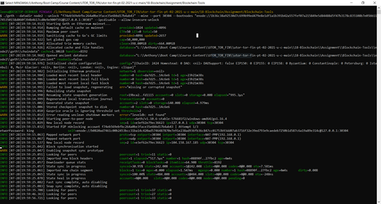

# Steps to create Proof of Authority Development Chain and Execute a Transaction

## Step 1: Downloading Set-up files
Create a folder named “Blockchain-Tools” and download the Geth set-up files from the link provided (https://geth.ethereum.org/downloads/). Depending on the OS choose the most suitable version. Ensure downloading the package provided in a zip folder and not as an executable (.exe) file.

## Step 2: Initializing the set-up directory
Extract all files from the zip folder, so that the set of .exe files are directly in the “Blockchain-Tools” Directory. The commands used in the remaining steps depend on the .exe files in the set-up directory. Hence, running command prompt (preferably, as an administrator) through this directory will be required. ***Always run the terminal from this “Blockchain-Tools” directory for all steps***. After extracting the downloaded set-up files, the “Blockchain-Tools” directory should look similar to the following screenshot:

## Step 3: Creation of two nodes for the network
Use the following command lines to create directories for the two nodes between which transactions will be executed. Replace node1 and node2 with other convenient node names, if required.

    ./geth --datadir node1 account new
    ./geth --datadir node2 account new

### Below, a screenshot for steps related to creation of node 2 has been provided for ready reference

Note: 
1. After executing command for node 1 and 2 respectively, a password will be required for each node. Create your passwords and save them in a secure place for ready reference. The passwords will be required while decrypting the keystore files.
2.	Ensure to make a note of the Public Address Keys for future reference.
3. The system will also provide a “Sealer Address” for each node which is the string of characters following “Øx” in the public address key (i.e. copy the whole string ignoring “Øx”)

Once the 2 nodes are created their corresponding directories must be visible under the “Blockchain-Tools” Directory as follows:

## Step 4: Creation of two nodes for the network
Open a fresh command prompt terminal and proceed to the Blockchain-Tools directory and follow the below steps. Kindly refer to the screenshots for reference. 
1.	Run the following command:

        ./puppet

2.	The terminal will prompt for a network name. Enter a suitable name as directed and note for future reference.
3.	Since we are generating a new genesis block, choose option 2 by entering “2”.
4.	Choose option 1 by entering “1” as there is no pre-existing genesis to import..
5.	Running a POA blockchain will require choosing “Clique – proof-of-authority” i.e. “2”.
6.	Leave blocks time at default.
7.	Seal the two Public Key Addresses derived from Step 3 above by entering them below each other. (Public Addresses begin with Øx).
8.	Use both the addresses again to pre-fund both nodes.
9.	Choose “no” for pre-funding the pre-compiled accounts with wei. This will keep the genesis cleaner.
10.	Choose a unique chain ID (generally “333”) which has not been used by any other existing network. Leave it blank, if required.
11.	Continue the next step by choosing “Manage existing genesis” (option 2)
12.	Finally export the genesis configurations by selecting option 2. Since you are already in the “Blockchain-Tools” directory, export them to the current directory. Note that this will fail to create two of the files (Aleth chain and Parity chain), but only “networkname.json” is required. In our screenshot example, the file is named “kanata.json” corresponding to the network name.

Refer to the screenshots below for reference.

## Step 5: Initialize the nodes with the genesis' json file
Once the genesis configurations are exported, initializing the nodes will require the following commands.

    ./geth --datadir node1 init networkname.json
    ./geth --datadir node2 init networkname.json

Ensure using the network name assigned in Step 4.2. this point onward. Refer to the screenshot below for reference. 

## Step 6: Running Node 1
1. Open a new terminal window and run the following command:

        ./geth --datadir node1 --unlock "SEALER_ONE_ADDRESS" --mine --rpc --allow-insecure-unlock

2. Refer Note (3) in Step 3 for “Sealer Address” and replace "SEALER_ONE_ADDRESS" with the appropriate string.
3. Enter the password for Node 1 set in Step 3 (even if the password prompt is not visible)
4. Copy the “enode://xxxxxx…” to a notepad (highlighted below in the screenshot for reference) which will be used to run node 2. 

## Step 7: Running Node 2
1. Open a new terminal window and run the following command:

        ./geth --datadir node2 --unlock "SEALER_TWO_ADDRESS" --mine --port 30304 --bootnodes "enode://”SEALER_ONE_ENODE_ADDRESS”@127.0.0.1:30303" --ipcdisable --allow-insecure-unlock

2. Replace "SEALER_TWO_ADDRESS" with the string explained in Note (3) in Step 3. Also replace the “SEALER_ONE_ENODE_ADDRESS” with the  “enode://xxxxxx…” pasted to the notepad (copied earlier in Step 8).
3. Enter the password for Node 2 set in Step 3 (even if the password prompt is not visible)
Nodes 1 and 2 are now mining blocks

## Step 8: MyCrypto – Setting up node 1
1. Open MyCrypto and click on “Add Custom Node” found at the bottom of the left margin
2. Enter the name for node1 set in Step 3, select “Custom”  in the Network dropdown. This will enable additional options as shown in the screenshot.
3. Enter network name and Chain ID configured in Steps 4.2 and 4.10 respectively. Enter Currency as ETH and URL as http://127.0.0.1:8545. (Note the use of “http” and not “https” in the URL)
4. Finally, click “Save & Use Custom Node”

## Step 9: MyCrypto – Unlocking node 1
1. In MyCrypto click on “View & Send” found at the top of the left margin and Select Keystore file in the bottom center of wallet access options.
2. Click “SELECT WALLET FILE” which will trigger a “Open file” dialogue box. Navigate to the keystore directory inside your Node1 directory, select the file located there
3. Provide your password when prompted and click Unlock. This will open your account wallet inside MyCrypto.
4. Your Node1 Account address and Account balance will be visible which would be pre-funded by test ETH.

## Step 10: MyCrypto – Transferring ETH from Node 1 to Node 2
1. Select Send Ether & Tokens from the top row of options (in the View & Send screen) 
2. In the “To Address” box type the account address from Node2, then fill in an arbitrary amount of ETH
3. Confirm the transaction by clicking "Send Transaction", and then "Send" button in the “Confirm Transaction” pop-up window.

## Step 11: Verify Transaction Status
Copy the transaction hash (TX Hash) and paste it into the "TX Status" section of the app, or click "TX Status" in the green popup at the bottom of the MyCrypto screen.

