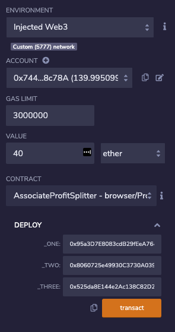
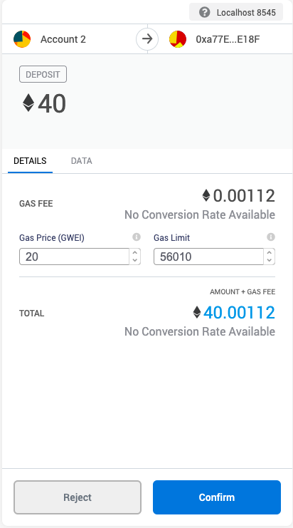
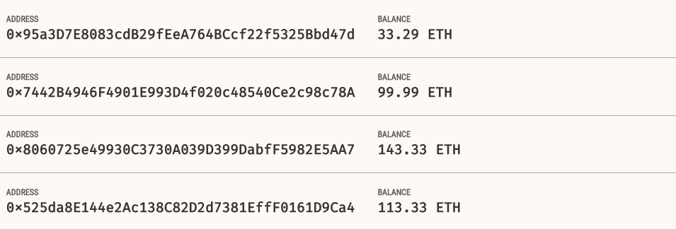
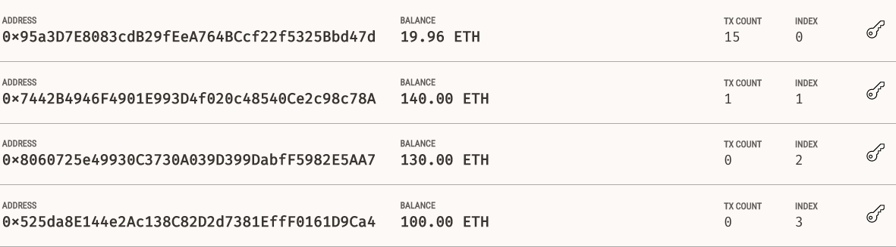
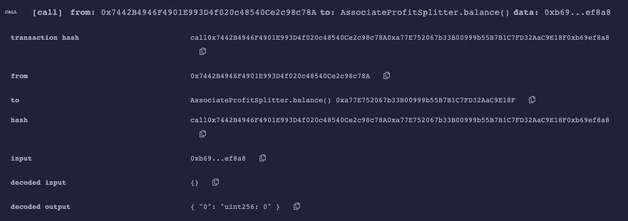

# ProfitSplitter

This assignment was created in using Solidity on Remix IDE, and uses the Ganache and MetaMask for execution (on localhost:8545)

## Associate Profit Splitter Contract

This contract has two main functions:
 
  1. Balance -- This function is set to `public view returns (uint)`, and returns the contract's current balance. Since we are always be sending ETH to the employees, this function is expected to return a '0' value. This will serve as a test function of sorts.
  
  2. Deposit -- This function is set to `public payable check`, ensuring that only the owner can call the function and transfer ETH to the three employees' addresses.

### Testing the Contract

The contract is compiled and then deployed by connecting to Injected Web3.

#### **Deploying and Assigning Employee Addresses:**

#### **Depositing 40 ETH through MetaMask:**

#### **Original Ganache Balances before transfer:**

#### **Updated Ganache Balances after transfer:**

 
**Calling Balance Function:**

The function returns a value of 0 indicating the deposit function is handling remainders successfully.

---
---

## Tiered Profit Splitter Contract

The deposit function has the following differences:
1. Number of points/units is computed using `msg.value`/100 allowing multiplication of the points with the number representing a percentage.
2. The `uint amount` variable is used to store trasnfer amount of each employee temporarily. For each employee, the amount is set equal to the number of points multiplied by the percentage i.e.:
  - For employee_one, distribute points * 60.
  - For employee_two, distribute points * 25.
  - For employee_three, distribute points * 15.
3. After calculating the amount for the first employee, the amount is added to the total to keep a running total of how much of the `msg.value` has been distributed.
4. After transfering the amount, the remainder is sent to the employee with the highest percentage by subtracting `total` from `msg.value`.

---
---

## Deferred Equity Plan Contract

This contract executes the following:
1. HR is assumed as deploying the contract and is set as 'msg.sender' in the constructor. 
2. Total shares is set at 1000
3. Annual distribution is set to 250. This equates to a 4 year vesting period for the total_shares, as 250 will be distributed per year. 
4. The `uint start_time = now;` line stores the contract's start date which is used to calculate the vested shares later. Below this variable, the `unlock_time` is set to `now` plus `365 days`. Each distribution period is incremebted accordingly.
5. The `uint public distributed_shares` tracks how many vested shares the employee has claimed and was distributed. By default, this is 0.
6. There is a distribute function that contains 2 `require` statements:
  - `unlock_time` is less than or equal to `now`.
  - `distributed_shares` is less than the `total_shares` the employee was set for.
7. After the `require` statements, `365 days` is added to the `unlock_time`. This calculates next year's unlock time before distributing this year's shares. We want to perform all of our calculations like this before distributing the shares.
8. The `distributed_shares` is equal to `(now - start_time)` divided by `365 days`, multiplied by the annual distribution. If `now - start_time` is less than `365 days`, the output will be `0` since the remainder will be discarded. If it is something like `400` days, the output will equal `1`, meaning `distributed_shares` would equal `250`.
9. The final `if` statement checks that in case the employee does not cash out until 5+ years after the contract start, the contract does not reward more than the total_shares agreed upon in the contract.

